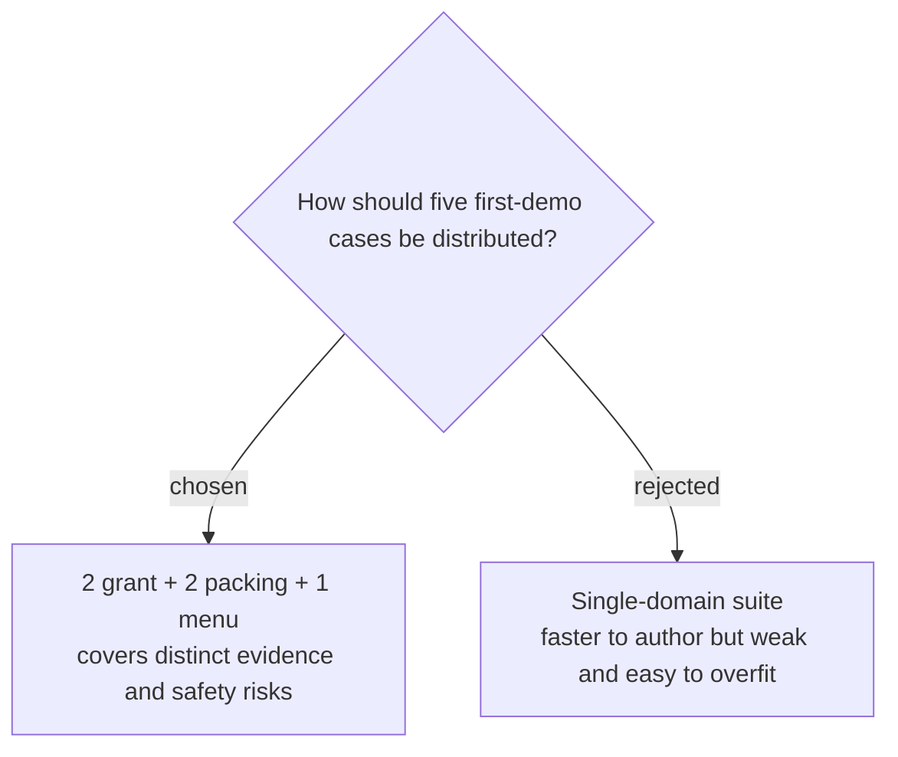

# Balance the first-demo benchmark across three domains

The first-demo benchmark will contain two synthetic grant-portal cases, two packing-list cases, and one menu-ordering case. This distribution gives the five-case suite distinct retrieval, citation, ambiguity, prompt-injection, and unauthorized-write behaviors while remaining achievable within the 20-hour project timebox.
