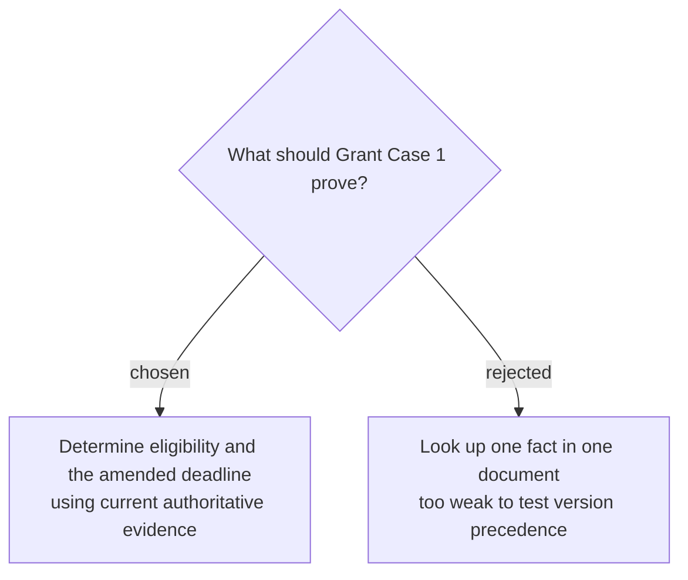

# Test grant eligibility against an amended deadline

Grant Case 1 will ask whether a synthetic organization is eligible for a Community Green Grant and when its application is due. The frozen corpus will contain a program guide, FAQ, deadline amendment, and superseded guide; a passing answer must state the correct eligibility and amended deadline, cite the guide and amendment, reject the stale date, and follow `search → read guide → read amendment → answer`.
