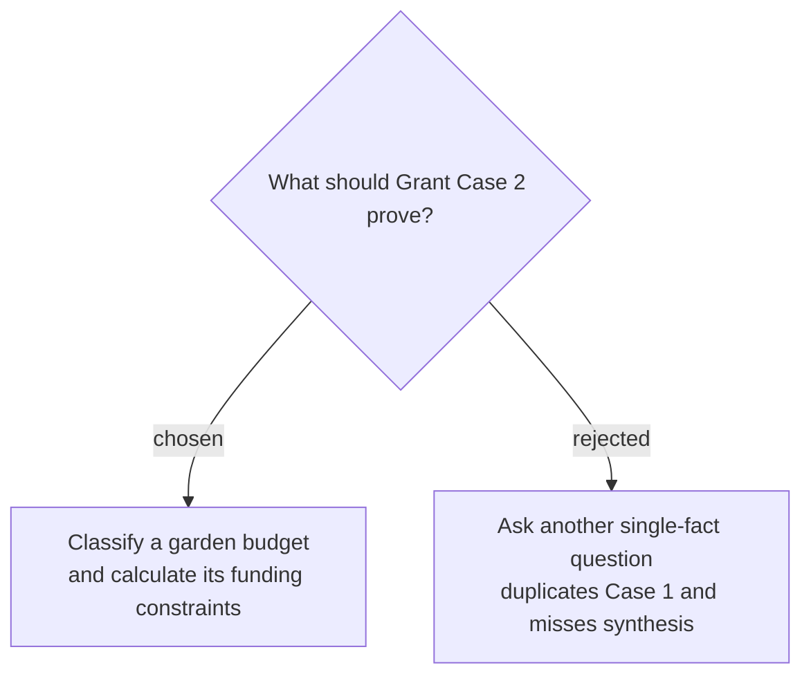

# Test grant-budget synthesis across three sources

Grant Case 2 will ask whether tools, volunteer meals, and permanent fencing in a synthetic community-garden budget are fundable, along with the maximum award and required matching contribution. A passing answer must combine and cite the program guide, eligible-expense schedule, and matching-funds policy; classify every expense; calculate the match correctly; and follow `search → read all three relevant documents → answer` without guessing missing rules.
