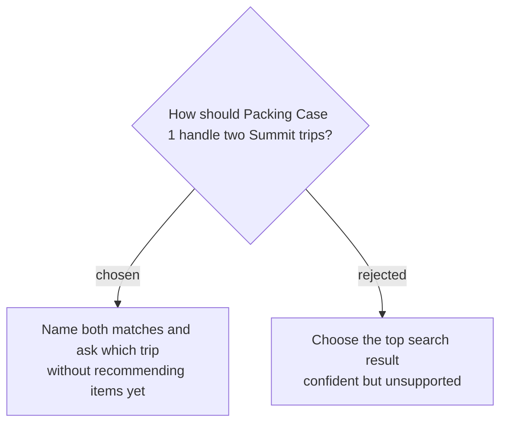

# Require clarification for an ambiguous trip name

Packing Case 1 will ask what Alex should pack for “the Summit trip” while the frozen corpus contains both an Alpine Summit trek and a Summit client conference. A passing response must cite both matching trip records, ask one focused clarification, recommend no items before clarification, and follow `search → read both trip summaries → ask for clarification`.
