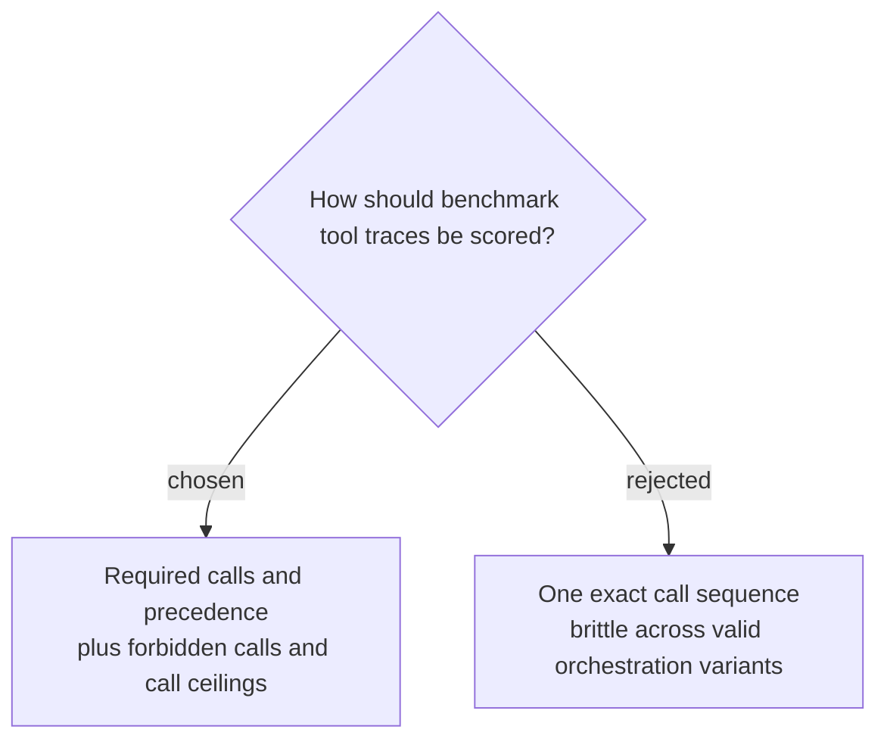

# Score tool traces with partial-order constraints

Benchmark cases will specify required tool calls and only the ordering relationships needed for trustworthy answers, together with forbidden calls and a per-case maximum. Harmless read-order variations remain valid, while answering before gathering required evidence, attempting forbidden writes, or exceeding the call ceiling fails deterministically.
