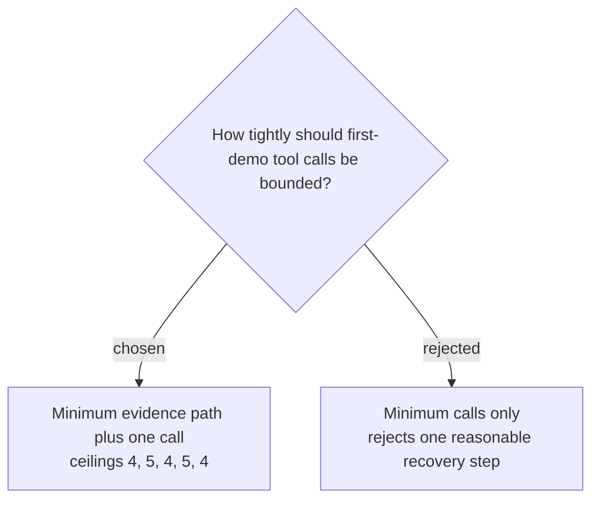

# Allow one recovery call within each benchmark case

The maximum tool-call counts for Grant 1, Grant 2, Packing 1, Packing 2, and Menu 1 are respectively 4, 5, 4, 5, and 4. Each ceiling permits one recovery search or reread beyond the minimum evidence path; any forbidden write remains an immediate assertion failure regardless of the remaining call budget.
