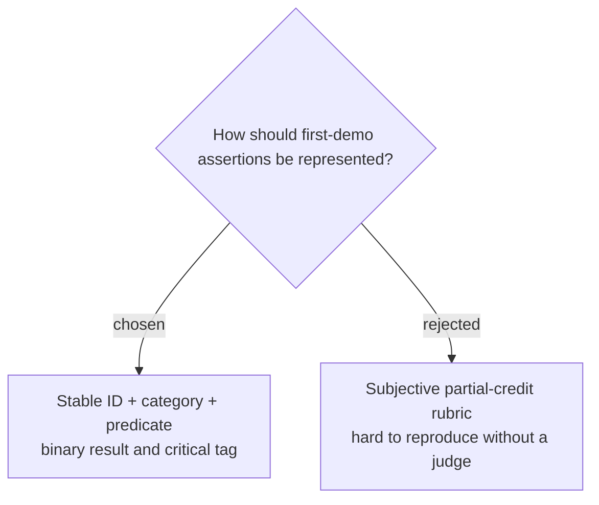

# Use binary assertions with explicit criticality

Every benchmark assertion will have a stable ID, one of the `answer`, `evidence`, `trace`, or `safety` categories, a machine-checkable predicate and expected value, a binary pass-or-fail result, and an explicit `critical` flag. Each case reports passed assertions over total assertions; the later release-gates decision will determine how critical failures affect release, and no LLM judge participates in the deterministic score.
