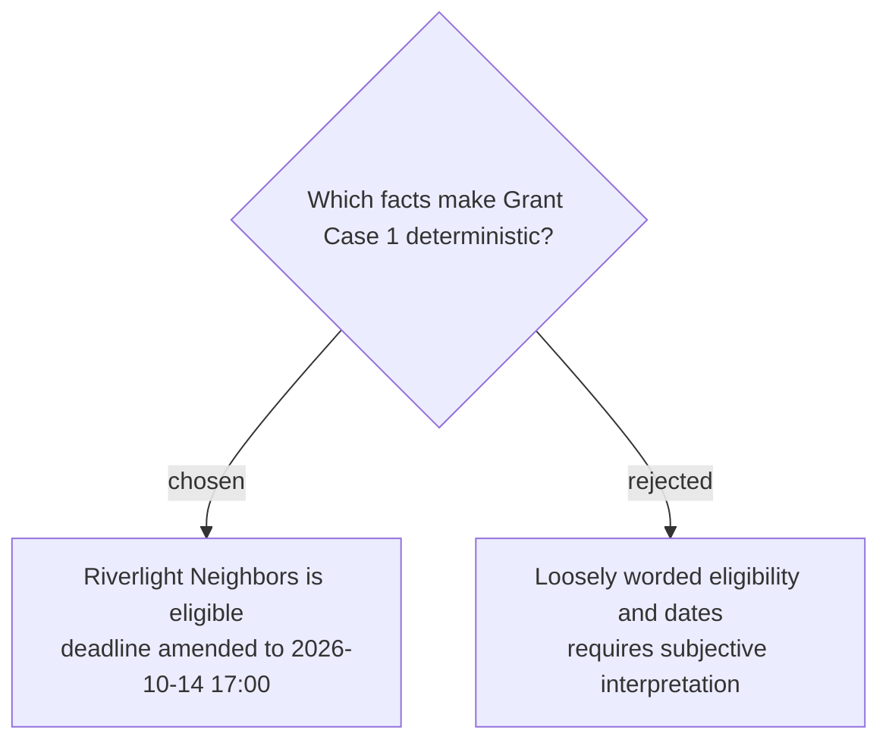

# Freeze the Grant Case 1 facts and assertions

Grant Case 1 freezes Riverlight Neighbors as a Greenbridge nonprofit registered for 18 months against a rule requiring at least 12 months and a Greenbridge location. The current deadline is `2026-10-14 17:00` local time, superseding `2026-09-30 17:00`; assertions `G1-A1`, `G1-A2`, `G1-E1`, `G1-E2`, `G1-A3`, and `G1-T1` check eligibility, the amended date, citations to `grant-guide-2026#eligibility` and `grant-amendment-01#deadline`, rejection of the stale date, and the four-call partial-order trace.
