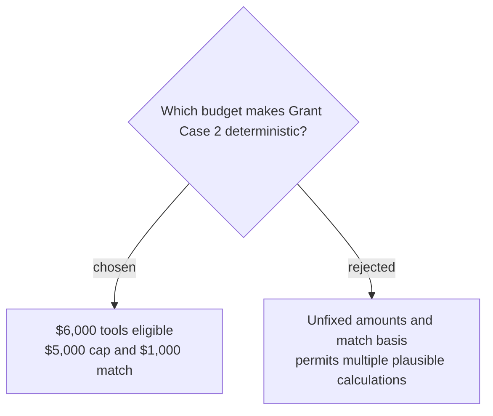

# Freeze the Grant Case 2 budget and assertions

Grant Case 2 freezes a proposed budget of `$6,000` for eligible tools, `$1,000` for ineligible volunteer meals, and `$3,000` for ineligible permanent fencing. The award is capped at `$5,000` with a match equal to 20% of the awarded amount, producing a `$1,000` match; deterministic assertions check every classification, the cap, the calculation, citations to `grant-guide-2026#award-limit`, `grant-expenses-2026#eligible-costs`, and `grant-match-policy#match`, and the five-call partial-order trace.
