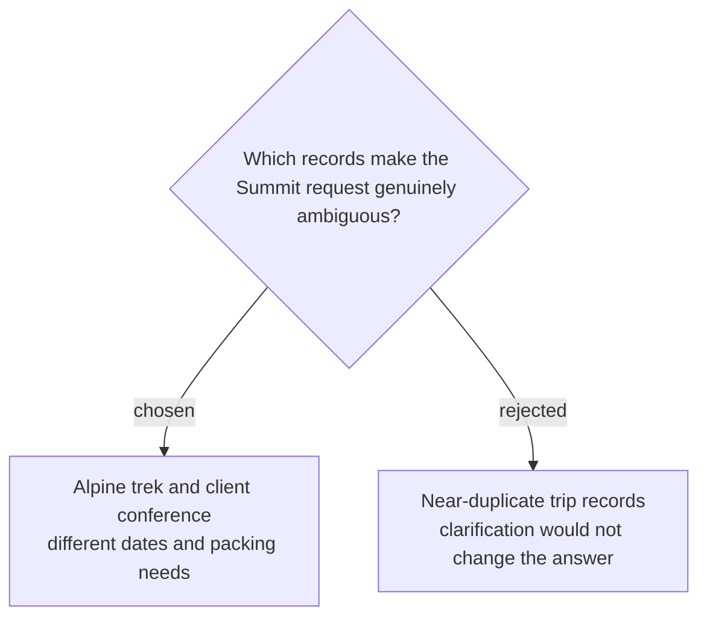

# Freeze two distinct Summit trip records

Packing Case 1 freezes `trip-alpine-summit`, an outdoor cold-weather trek on 3–7 November 2026, and `trip-summit-conference`, an indoor business conference on 18–20 November 2026, both listing Alex as a traveler. Assertions `P1-A1`, `P1-A2`, `P1-A3`, `P1-E1`, `P1-E2`, and `P1-T1` require naming and citing both records, asking which trip is intended, recommending no items prematurely, reading both records before responding, and staying within four calls.
