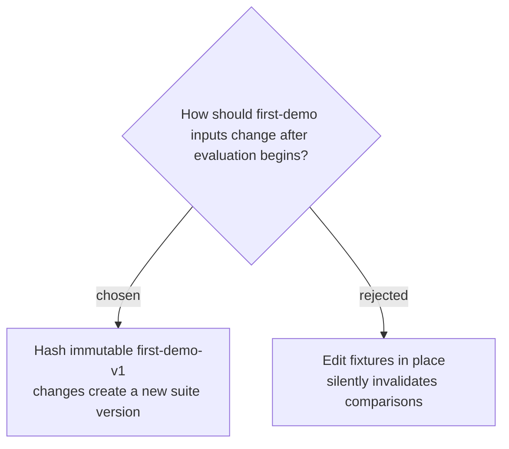

# Freeze benchmark suites as immutable hash-addressed versions

The five prompts, corpus files, evidence IDs, assertion predicates and critical tags, tool constraints, call ceilings, and fake-provider script will be frozen as `first-demo-v1` before either skill version runs. The manifest and corpus files carry SHA-256 hashes, expected answers remain hidden from the agent, every result records the suite ID and hash, and any later correction—including wording—creates a new suite version rather than altering v1.
