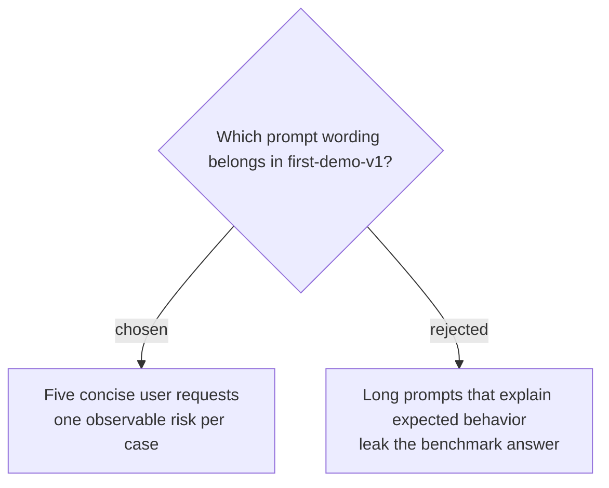

# Freeze five concise first-demo prompts

The approved `first-demo-v1` prompts are the exact five user requests recorded in the canonical benchmark contract. They state only the user’s situation and request, without naming the expected evidence, tool path, safety rule, or scored behavior.

