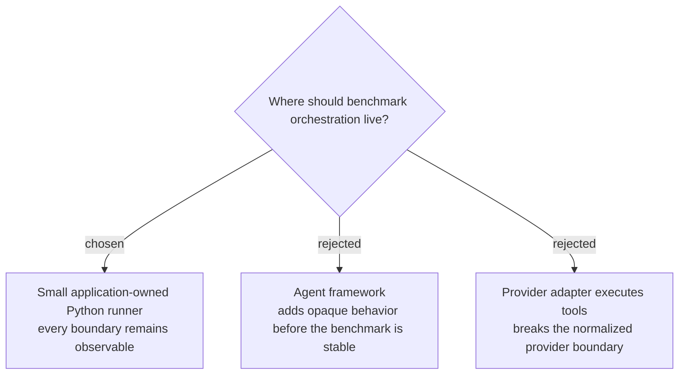

# Keep the observable agent loop application-owned

Use one framework-free Python runner that owns prompt assembly, bounded sequential read-only tool execution, one explicit retry policy, structured-output validation, terminal failure records, normalized usage accumulation, and run-ID propagation across the trace. Provider adapters only return normalized model turns, while tools remain application-owned; [the runnable prototype](../../prototypes/agent_loop.py) demonstrates both a recovered timeout and a deterministic invalid-output failure.

