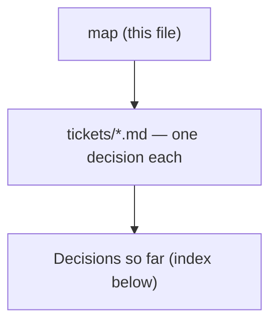

# Decision map - AI Agent Evaluation Lab

## Destination
A runnable, portfolio-ready AI agent evaluation lab that compares two skill versions on a frozen synthetic benchmark and produces reproducible evidence for accuracy, citations, safety, latency, token usage, and cost.

## Notes

<!-- decision-map:notes:start -->
- Use mini-projects/01-ai-agent-evaluation-lab.md as the existing project brief.
- Use Python with a small custom orchestration loop before adopting an agent framework.
- The first release runs locally in Docker, uses a fake model for normal tests, and limits manually triggered cloud-model runs to THB 300 total.
- Keep model and retrieval boundaries replaceable so a local model on a future Mac can be added without changing the evaluation pipeline.
- Prepare the project for public GitHub publication using synthetic data and a secret scan, but do not publish without explicit approval.
- Deterministic evaluators are the release gate; an LLM judge may add advisory scores but cannot override safety or citation failures.
<!-- decision-map:notes:end -->

## Milestones

<!-- decision-map:milestones:start -->
- `first-demo` demo five synthetic cases end to end [benchmark-contract, provider-boundary, agent-loop, retrieval-experiment, safety-policy, evaluation-release-gates, trace-cost-contract, comparison-report]
<!-- decision-map:milestones:end -->

## Decisions so far

<!-- decision-map:decisions:start -->
#### first-demo — demo five synthetic cases end to end

- [Agent loop - what is the smallest observable orchestration loop for the benchmark?](tickets/agent-loop.md) — Use a framework-free application-owned Python runner for prompt assembly, bounded read-only tools, retries, schema validation, failures, usage, and correlated traces.
- [Benchmark contract - which five cases and assertions are frozen for the first demo?](tickets/benchmark-contract.md) — Freeze first-demo-v1 as five hash-addressed synthetic cases—2 grant, 2 packing, 1 menu—with binary assertions, partial-order tool traces, and immutable versioning.
- [Provider boundary - what interface keeps cloud, fake, and local models interchangeable?](tickets/provider-boundary.md) — Use one immutable ModelProvider.generate contract with normalized messages, tools, outputs, usage, capabilities, and errors; keep cloud, scripted-fake, and local adapters separate.
<!-- decision-map:decisions:end -->

## Not yet specified

<!-- decision-map:fog:start -->
- The exact local model, runtime, quantization, and Mac performance target remain unknown until the Mac and candidate models are available.
- The Azure hosting architecture and managed-service choices remain unspecified for the later cloud slice.
- The publication repository URL and launch timing remain unspecified until the private artifact passes its release checks.
<!-- decision-map:fog:end -->

## Out of scope

<!-- decision-map:scope:start -->
- A Web UI is outside the first release; the user experience is a CLI plus Markdown and JSON reports.
- Azure deployment is outside the first release; local Docker reproducibility is sufficient.
- Authentication and multi-user behavior are outside the first release.
- Running a local model on the future Mac is outside the first release, although the provider boundary must allow it later.
- Multi-agent orchestration is outside the first release.
- Company, customer, and other non-synthetic data are outside the project.
<!-- decision-map:scope:end -->
