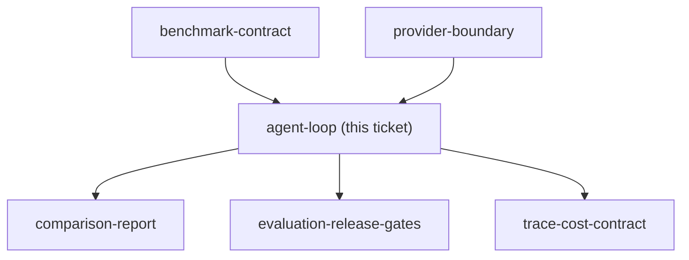

## Question

What minimal custom Python orchestration loop demonstrates prompt assembly, bounded read-only tools, retrieval, retries, structured-output validation, failure handling, and trace propagation while remaining understandable without an agent framework?

<!-- decision-map:graph:start -->

<!-- decision-map:graph:end -->
