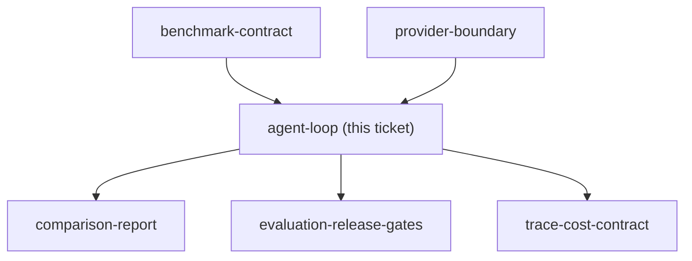
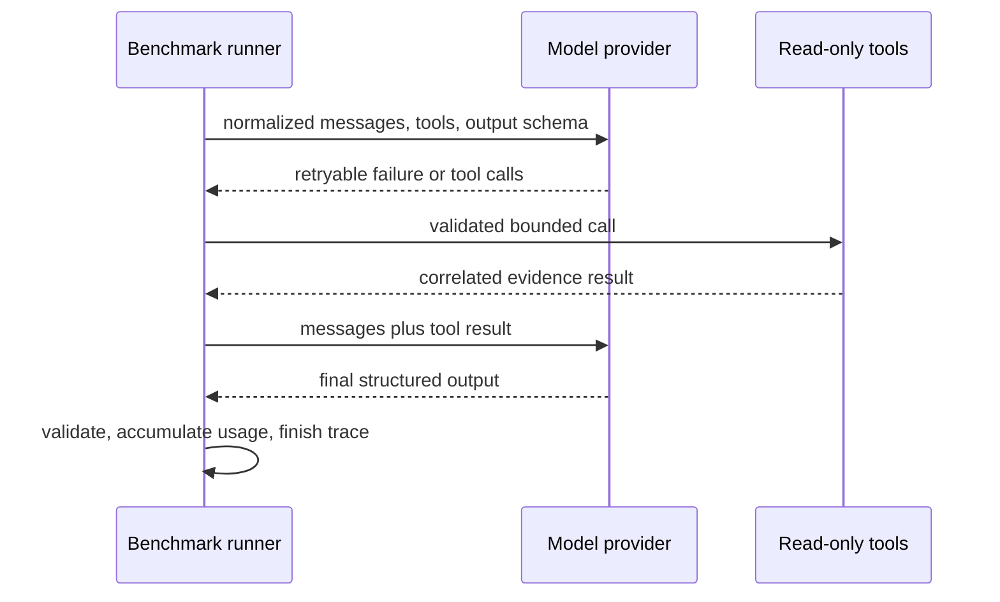

## Question

What minimal custom Python orchestration loop demonstrates prompt assembly, bounded read-only tools, retrieval, retries, structured-output validation, failure handling, and trace propagation while remaining understandable without an agent framework?

<!-- decision-map:graph:start -->

<!-- decision-map:graph:end -->

## Comment

## Prototype artifact

[Runnable agent-loop prototype](../../../../prototypes/agent_loop.py)

Verified in the working tree based on `main` (`3bd7fa9`):

- `python prototypes/agent_loop.py --scenario success` completed with three read-only calls, one retry, schema-valid output, and a 14-event correlated trace.
- `python prototypes/agent_loop.py --scenario invalid-output` failed deterministically with `invalid_output`.
- `python -m py_compile prototypes/agent_loop.py` passed.

<!-- decision-map:resolution:start -->
## Resolution

Use a framework-free application-owned Python runner for prompt assembly, bounded read-only tools, retries, schema validation, failures, usage, and correlated traces.

Detail: docs/adr/agentlens-017-application-owned-agent-loop.md

Confirming exchange: the user approved the runnable prototype with: “ok”.

<!-- decision-map:resolution:end -->
