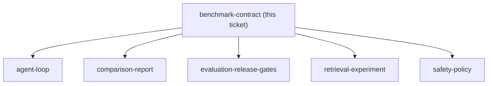

## Question

Which five synthetic requirement cases, expected evidence sets, expected tool sequences, scored assertions, and freeze rules make the first benchmark representative without exceeding the 20-hour project timebox?

<!-- decision-map:graph:start -->

<!-- decision-map:graph:end -->
