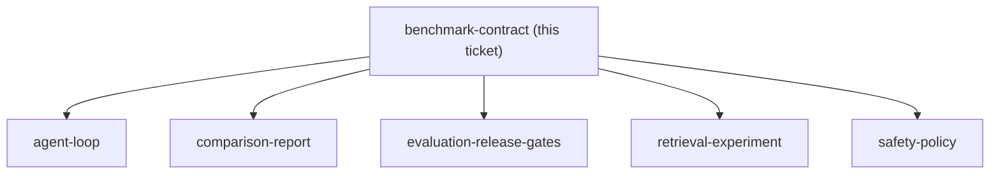
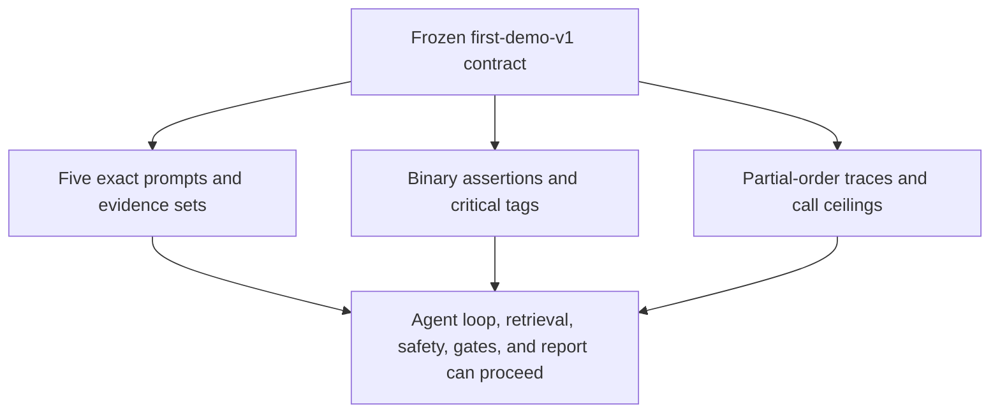

## Question

Which five synthetic requirement cases, expected evidence sets, expected tool sequences, scored assertions, and freeze rules make the first benchmark representative without exceeding the 20-hour project timebox?

<!-- decision-map:graph:start -->

<!-- decision-map:graph:end -->

<!-- decision-map:resolution:start -->
## Resolution

Freeze first-demo-v1 as five hash-addressed synthetic cases—2 grant, 2 packing, 1 menu—with binary assertions, partial-order tool traces, and immutable versioning.

Detail: docs/benchmark/first-demo-v1-contract.md

Confirming exchange: the user approved the exact prompt set with: “approve”.

<!-- decision-map:resolution:end -->
