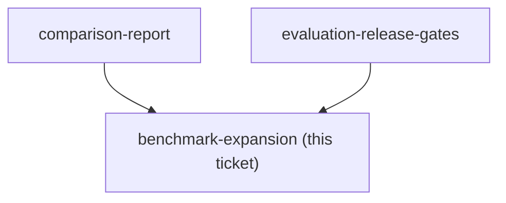

## Question

After the five-case demo is stable, how should the benchmark expand to fifteen cases across the grant portal, packing list, and menu-ordering fixtures while preserving frozen expectations and avoiding test cases selected to flatter v2?

<!-- decision-map:graph:start -->

<!-- decision-map:graph:end -->
