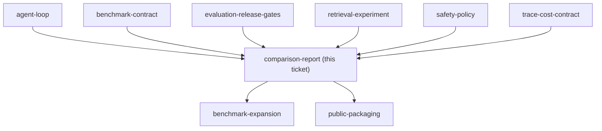

## Question

What Markdown and JSON report structure makes per-case failures, aggregate v1-versus-v2 deltas, retrieval differences, safety results, latency, tokens, and cost understandable in a short portfolio walkthrough?

<!-- decision-map:graph:start -->

<!-- decision-map:graph:end -->
