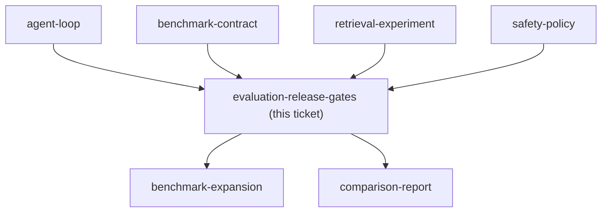

## Question

Which deterministic evaluators, aggregation rules, failure precedence, minimum thresholds, and optional LLM-judge boundaries decide whether v2 improves on v1 without hiding failed safety, citation, schema, or hallucination cases?

<!-- decision-map:graph:start -->

<!-- decision-map:graph:end -->
