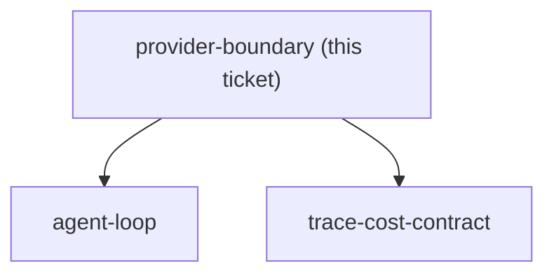
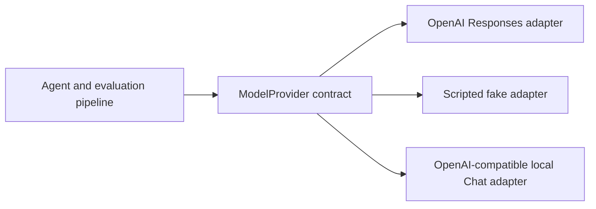

## Question

What is the smallest provider interface and normalized message, tool-call, structured-output, usage, and error contract that supports one cloud model now, deterministic fake-model tests, and an OpenAI-compatible local model later without leaking provider-specific behavior into the evaluation pipeline?

<!-- decision-map:graph:start -->

<!-- decision-map:graph:end -->

<!-- decision-map:resolution:start -->
## Resolution

Use one immutable ModelProvider.generate contract with normalized messages, tools, outputs, usage, capabilities, and errors; keep cloud, scripted-fake, and local adapters separate.

# Raw findings - provider boundary

## Recommended boundary

Own one small `ModelProvider` protocol inside the application. Normalize requests, results, capabilities, usage, finish reasons, and errors. Keep model name, API key, endpoint, timeout, retry settings, and provider selection in adapter configuration rather than the request passed through the benchmark.

Use separate adapters:

- `OpenAIResponsesProvider` for the first cloud model.
- `FakeProvider` for deterministic unit and benchmark tests.
- `OpenAICompatibleChatProvider` for LM Studio or `llama.cpp` later.

Do not treat `base_url` as the only difference. The OpenAI Responses API returns ordered output items, whereas local compatibility is commonly centered on `/v1/chat/completions`; adapters must translate their native wire formats into the same internal types. OpenAI also warns that Responses output length and item order vary, so application code must not assume the first output item is an assistant message. Source: [OpenAI Responses API](https://developers.openai.com/api/reference/cli/resources/responses/methods/create).

## Minimum normalized contract

The internal request needs:

- messages using only `system`, `user`, `assistant`, and `tool` roles;
- tool specifications containing name, description, and plain JSON Schema;
- optional plain JSON Schema for the final structured output;
- `auto`, `none`, or `required` tool choice;
- maximum output tokens, temperature, and a version-one default of no parallel tool calls.

The internal result needs:

- one normalized assistant message with an ordered tuple of tool calls;
- parsed output only after local schema validation;
- normalized finish reason;
- nullable token usage;
- model ID plus optional response and request IDs.

Each provider exposes capabilities for tool calls, constrained versus prompt-only structured output, usage reporting, parallel calls, and explicit refusals. A provider-independent preflight rejects unsupported experiments instead of silently changing them.

## Tool and output rules

- Preserve provider tool-call IDs and associate every tool result with the matching ID.
- Parse tool arguments into an object before returning them; invalid JSON, an unknown tool, or schema-invalid arguments becomes a non-retryable `bad_response`.
- Adapters request tools but never execute them. The application-owned agent loop executes and traces them.
- Use strict schemas: every property required, nullable types for optional values, and `additionalProperties: false` on objects.
- Keep plain JSON Schema in the core contract; adapters add provider-specific wire wrappers.
- Validate structured output locally even when the provider claims constrained generation.
- Treat refusal and incomplete output as separate finish reasons rather than schema failures.

OpenAI documents matching function results by call ID, multiple calls, disabling parallel calls, and strict schema requirements. Sources: [function calling](https://developers.openai.com/api/docs/guides/function-calling) and [structured outputs](https://developers.openai.com/api/docs/guides/structured-outputs).

LM Studio supports JSON-schema constrained output through its OpenAI-compatible Chat Completions endpoint, but model reliability varies. It distinguishes native tool-use support from fallback prompt parsing. Sources: [LM Studio structured output](https://lmstudio.ai/docs/developer/openai-compat/structured-output) and [LM Studio tool use](https://lmstudio.ai/docs/developer/openai-compat/tools).

`llama.cpp` requires suitable chat templates for function calling and does not claim complete OpenAI API compatibility. Source: [`llama.cpp` server](https://github.com/ggml-org/llama.cpp/blob/master/tools/server/README.md).

## Usage, latency, and cost

Normalize only measured `input_tokens`, `output_tokens`, `total_tokens`, `cached_input_tokens`, and `reasoning_tokens`. Missing usage is `null`, never zero. Derive totals only when both inputs are known. Measure wall-clock latency in the runner. Compute cost outside adapters with a versioned price table keyed by provider, model, and date. Local monetary cost remains `null` unless an explicit electricity and hardware accounting model exists.

OpenAI exposes input, output, total, cached-input, and reasoning token details. `llama.cpp` additionally exposes server-specific timings, which should remain opaque diagnostics rather than evaluator inputs. Sources: [OpenAI Responses usage](https://developers.openai.com/api/reference/cli/resources/responses/methods/retrieve) and [`llama.cpp` timings](https://github.com/ggml-org/llama.cpp/blob/master/tools/server/README.md#timings-and-context-usage).

## Errors and retries

Normalize errors to `invalid_request`, `authentication`, `permission`, `not_found`, `rate_limit`, `timeout`, `connection`, `unavailable`, `unsupported`, or `bad_response`. No SDK exception crosses the boundary. Preserve status, provider code, and request ID only as diagnostics, and set an explicit `retryable` flag.

For reproducible benchmark runs, default to zero retries. If a manually triggered live regression enables retries, use one shared bounded runner policy and record attempts plus elapsed time. Disable hidden SDK retries when the runner owns retry behavior. The official OpenAI Python library retries connection failures, 408, 409, 429, and 5xx responses twice by default, so it must be configured deliberately. Source: [OpenAI Python SDK retry behavior](https://github.com/openai/openai-python#retries).

## Deterministic fake

Make the fake provider script-driven, with an ordered sequence of exact expected requests and either normalized results or normalized errors. Use deterministic call IDs and explicit usage and finish reasons. Include fixtures for refusal, length, invalid output, timeout, and rate limiting, and assert the whole script was consumed. `temperature=0` is not a deterministic test substitute.

## Experiment invariants and pitfalls

- OpenAI-compatible means a similar wire shape, not identical semantics or model quality.
- Never leak Responses output items, Chat `choices`, SDK classes, or local template fields beyond adapters.
- Never silently repair invalid tool arguments or downgrade constrained output to prompt-only output.
- Never treat missing usage as zero or local inference as zero-cost.
- Compare skill versions using the same provider, model snapshot, schemas, retry policy, and capability mode.
- Pin cloud snapshots and local model artifact hashes in run metadata.
- Disable parallel tool calls and streaming in version one, while keeping the internal types extensible.

## Recommended decision

Use one immutable `ModelProvider.generate()` contract with normalized messages, JSON-schema tools and outputs, validated tool calls, nullable usage, capability preflight, and typed retryable errors. Implement separate OpenAI Responses, scripted fake, and OpenAI-compatible local Chat adapters so provider wire formats never reach the agent or evaluation pipeline.

<!-- decision-map:resolution:end -->
