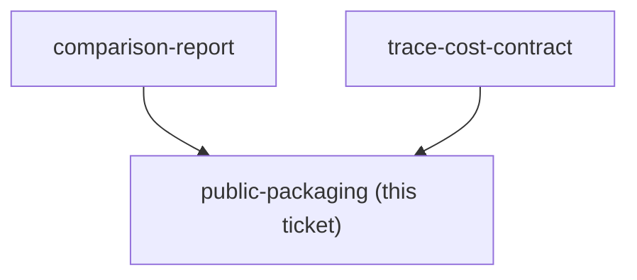

## Question

Which Docker, CLI, documentation, deterministic GitHub Actions, schema-validation, license, synthetic-data, and secret-scan checks are required before this private project may be approved for public GitHub publication?

<!-- decision-map:graph:start -->

<!-- decision-map:graph:end -->
