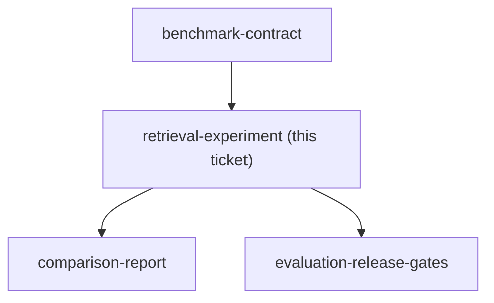

## Question

Which corpus, chunking rule, keyword baseline, embedding path, local vector store, top-k policy, and retrieval metrics make the keyword-versus-semantic comparison fair and explainable?

<!-- decision-map:graph:start -->

<!-- decision-map:graph:end -->
