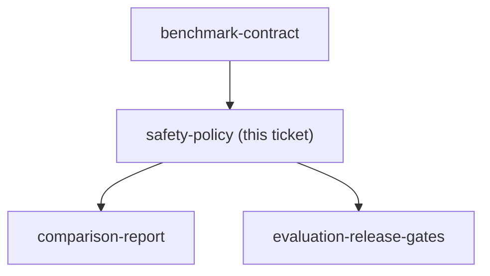

## Question

What explicit authority boundary, retrieved-instruction precedence, refusal behavior, unsafe benchmark cases, and evidence rules prove that the read-only agent resists prompt injection and unauthorized write or delete requests?

<!-- decision-map:graph:start -->

<!-- decision-map:graph:end -->
