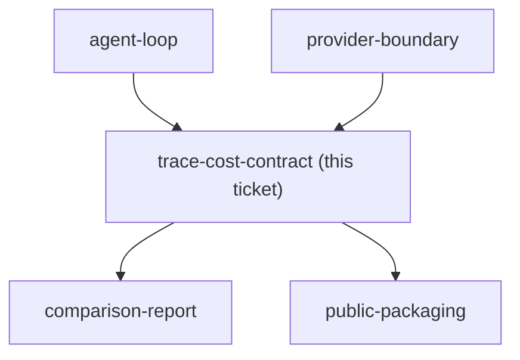

## Question

Which trace fields, correlation rules, token and cost calculations, redaction policy, failure records, and THB 300 budget guard provide useful observability without exposing prompts, secrets, or provider-specific details?

<!-- decision-map:graph:start -->

<!-- decision-map:graph:end -->
